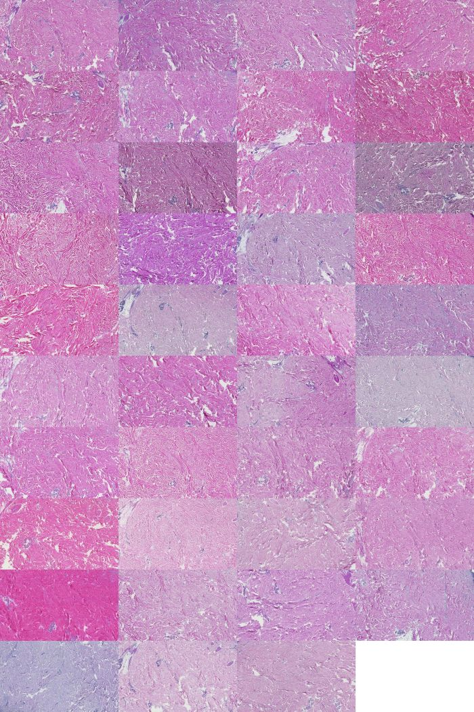

# Unsupervised Learning with Quality Laboratory Data
- The aim was to investigate effects of color normalization between laboratories and tissue types.

## Unsupervised Learning with Quality Laboratory Data
- To generate the data run the gen_pre_pro_data.py on given image set;
- To analyze the data proceed with Clustering script designed for Orange3 platform (can also run from within python). Simply point to the data stored when within Orange3 enviorment.
-  Spectrum folder contains finalized PCA data for the different tissue types (C1 = Kidney, C2= Skin, 3 = Colon tissue type)
-  Plots folder contains the resulting clusters between tissue types and laboratories.
