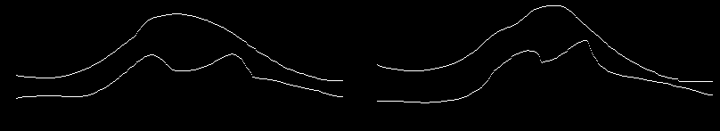

 - Forks from https://github.com/fyu/drn and https://github.com/milesial/Pytorch-UNet 
 - A tool for segmenting the joint space of the knee automatically. The found edges of the joint space can be used to find the edges of the femur and the tibia for calculation of different features of osteoarthritis.
 - UNET and DRN - architectures trained with histogram-equalized 5570 radiographs cropped to the knee joint region from OAI-dataset with segmentation-masks generated by a method based on edge detection described in (https://github.com/AI-hub-keskisuomi/AI_hub_keskisuomi/tree/main/WP3_knee_osteoarthritis/EdgeDetection). The training images were hand-selected to only ones where the method works accurately (58% of original images). 
 - Tested in a completely separate dataset of images from MOST
    -Unet achieves IOU-score of .93.
    -DRN achieves IOU of .90
 - A method for finding the location of the eminentia and calculating its height and angle as well as a method for estimating the joint space width from the detected edges is also included
 - Training with train.py
    - Assumes training data in folder called training_data including folders "data" for knee x-rays and "target" for segmentation-masks
    - Assumes the last character in image names to specify which side knee is in the x-ray for creating the validation split so that knees from the same patient end up in the same side of the split.
 - Prediction and feature-calculation on DICOM-files with predict.py using commandline arguments:
 ```
  -h, --help            show this help message and exit
  --architecture {unet,drn}, -a {unet,drn}
                        Architecture of the loaded model, choices: unet, drn
  --model FILE, -m FILE
                        Specify the file in which the model is stored
  --save, -sv           save the images as they are processed
  --input-dir I, -i I   Directory with dicom images to predict or the path to a single dicom-image
  --scale SCALE, -s SCALE
                        Downscaling factor of the images, defaults to 1 (no downscaling)
  --mask-threshold MASK_THRESHOLD, -t MASK_THRESHOLD
                        Minimum probability value to consider a mask pixel white
    ```
